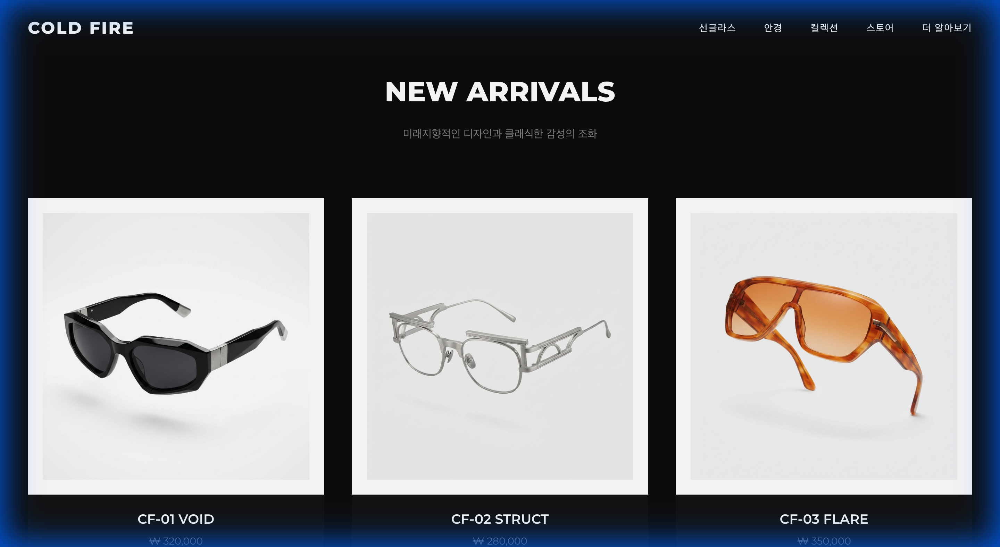

# 🕶️ Cold Fire
> 프리미엄 선글라스 브랜드 **Cold Fire**의 2026 컬렉션 웹사이트입니다. 모던하고 미니멀한 다크 테마 디자인을 통해 브랜드의 고급스러움을 표현했습니다.

### 🔥 **Live Demo**: [https://redspy.github.io/coldfire](https://redspy.github.io/coldfire)

---

## 📸 스크린샷

### 메인 화면 (Hero Section)


### 제품 컬렉션 (Collection Grid)


---

## ✨ 주요 기능
- **반응형 디자인 (Responsive Design)**: 모바일, 태블릿, 데스크탑 등 모든 해상도에 최적화된 레이아웃.
- **다크 모드 UI**: 브랜드 아이덴티티를 강조하는 깊이 있는 블랙 테마와 세련된 타이포그래피.
- **인터랙티브 요소**: 버튼 및 네비게이션 링크의 호버링 애니메이션 효과.
- **유연한 템플릿**: `template.html`을 통해 일관된 디자인의 서브 페이지 확장 가능.

## 🛠️ 기술 스택
- **HTML5**: 시맨틱 마크업 구조
- **CSS3**: 외부 라이브러리 없는 순수 CSS (Flexbox, Grid 활용)
- **Git & GitHub**: 버전 관리 및 배포

## 🚀 설치 및 실행 방법

### 1. 프로젝트 클론
```bash
git clone https://github.com/redspy/coldfire.git
cd coldfire
```

### 2. 로컬 서버 실행
Python이 설치되어 있다면 간단하게 로컬 서버를 띄울 수 있습니다.
```bash
# Python 3.x
python3 -m http.server 8000
```

### 3. 브라우저 확인
브라우저 주소창에 `http://localhost:8000`을 입력하여 접속합니다.

---

## ➕ 신규 안경/선글라스 추가 및 페이지 구성 방법

이 프로젝트는 확장성을 고려하여 설계되었습니다. 새로운 안경이나 선글라스를 추가하려면 아래 단계를 따르세요.

### 1단계: 이미지 에셋 준비
1. 새로운 제품 이미지(`png` 또는 `jpg`)를 준비합니다.
2. 배경이 제거된 누끼 이미지나, 깨끗한 배경의 제품 샷이 가장 좋습니다.
3. 이미지를 `assets/images/` 폴더에 위치시킵니다.
    - 예: `assets/images/glasses_04.png`

### 2단계: 상세 페이지 생성 (`product-cfXX.html`)
기존의 제품 페이지(`product-cf01.html`)를 복사하여 새로운 파일을 만듭니다.
```bash
cp product-cf01.html product-cf04.html
```

생성된 파일(`product-cf04.html`)을 열어 다음 내용을 수정합니다:
- **이미지 경로**: `src` 속성을 새 이미지 경로로 변경 (예: `assets/images/glasses_04.png`)
- **제품명**: `<h1>` 태그 내의 제품명 변경 (예: CF-04 NEON)
- **가격**: 가격 정보 수정
- **설명**: 제품에 맞는 매력적인 설명으로 변경

### 3단계: 메인 페이지(`index.html`)에 제품 추가
`index.html` 파일을 열고 `.product-grid` 섹션을 찾습니다.
가장 마지막 `<a>...</a>` 태그(제품 카드) 뒤에 아래 코드를 추가합니다.

```html
<!-- 새로운 제품 카드 -->
<a href="product-cf04.html" class="product-card scroll-reveal">
    <div class="product-image-wrapper">
        
        <div class="product-overlay">
            <span class="btn-shop">VIEW DETAILS</span>
        </div>
    </div>
    <div class="product-info">
        <h3>제품명 (CF-04)</h3>
        <p class="price">$350.00</p>
    </div>
</a>
```

### 4단계: 확인
웹사이트를 새로고침하여 메인 페이지 그리드에 새 제품이 추가되었는지, 클릭 시 상세 페이지로 잘 이동하는지 확인합니다.

---
© 2026 Cold Fire. All rights reserved.
